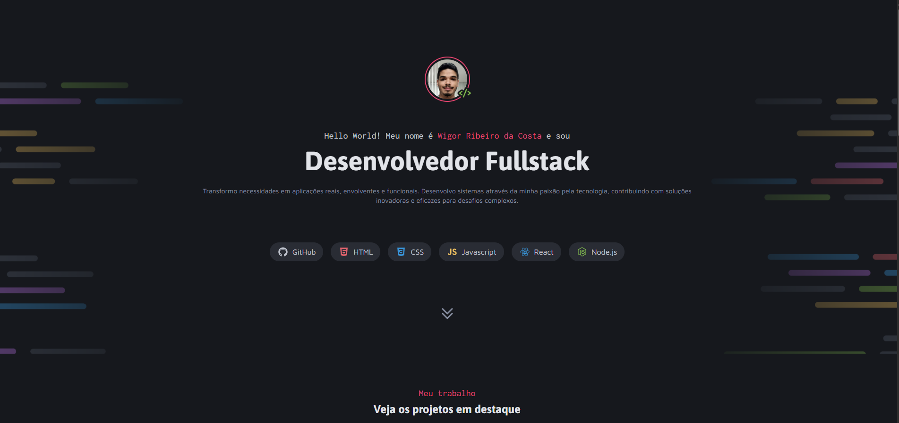

### 🚀 Desafio Portfolio Dev - Rocketseat

Este é o projeto do **desafio "Portfolio Dev"** do curso Fullstack da [Rocketseat](https://www.rocketseat.com.br/), cujo objetivo é desenvolver um **site estático de portfólio para desenvolvedores**, com foco em HTML e CSS moderno

--

## 🖼️ Prévia do Projeto

---

### 📋 Sobre o projeto

O **Portfolio Dev** é um site pessoal responsivo

O projeto foi desenvolvido como parte do **desafio de formação Fullstack da Rocketseat**, com base em um layout fornecido no Figma, e tem como principal objetivo colocar em prática os conceitos fundamentais de HTML e CSS.

- **Introdução (Header)**: Apresentação com foto, cargo e uma breve biografia. Também conta com ícones das tecnologias dominadas, como HTML, CSS, JavaScript, React e Node.js.
- **Projetos**: Cards com miniaturas, título e descrição dos principais projetos desenvolvidos, com link direto para visualização online.

- **Serviços**: Lista dos serviços oferecidos, como desenvolvimento de sites, APIs e DevOps, com ícones personalizados para cada um.

- **Contato**: Cartões clicáveis com links para LinkedIn, Instagram, GitHub e E-mail, facilitando a conexão com possíveis clientes ou recrutadores.

---

### 🛠️ Tecnologias Utilizadas

- **HTML5**
- **CSS3**

---

## 📚 Conceitos aplicados

- Estrutura semântica com HTML
- Layout responsivo utilizando **Flexbox** e **Grid**
- Organização modular com `classes` CSS
- Uso de variáveis CSS para cores e espaçamentos
- Separação clara entre HTML (estrutura) e CSS (estilo)

---

### 👨‍💻 Autor

Desenvolvido por Wigor.
